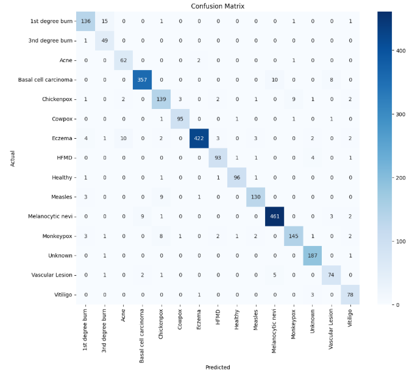

# 🧠 Skin Disease Classification using Deep Learning


---

## 📌 Overview
This project is a **deep learning-based multi-class skin disease classification system** built to detect and classify different skin conditions from medical images.

The model takes an input image and predicts the most probable skin disease among **37 different classes**.

> 🎯 I was responsible for building the **complete end-to-end deep learning model**, including architecture design, training, fine-tuning, evaluation, and deployment.
> 
>### Project Structure
├── dataset/
├── models/
├── notebooks/
├── app/
├── training.ipynb
├── preprocessing.py
├── Dockerfile
├── requirements.txt
└── README.md

---

## 👨‍💻 My Role
I independently developed the **entire machine learning model lifecycle**, including:

- Designing the deep learning architecture
- Handling large-scale multi-class classification (15 classes)
- Data preprocessing and augmentation
- Training and fine-tuning the model
- Evaluating performance using multiple metrics
- Improving generalization and reducing overfitting
- Experimenting with EfficientNetV2L as the backbone

---

## 📊 Dataset
- 📁 ~22,000 images
- 🏷️ 15 skin disease classes
-https://www.kaggle.com/datasets/mohamedjadallah/skin-disease-image-dataset
### Includes conditions such as:
•	1st degree burns
•	3rd degree burns
•	Melanocytic nevi
•	Basal cell carcinoma
•	Chickenpox
•	Cowpox
•	Unknown
•	Vascular lesion
•	Eczema
•	Vitiligo
•	Healthy
•	HFMD
•	Measles
•	Acne
•	Monkeypox


---

## 🧠 Model Architecture
- Backbone: **EfficientNetV2L**
- Framework: TensorFlow / Keras
- Input Size: **380 × 380**
- Type: Transfer Learning + Fine Tuning
- Task: Multi-class Image Classification

---

## ⚙️ Training Details
- Optimizer: Adam
- Loss Function: Categorical Crossentropy
- Batch Size: `32`
- Epochs: `10` Then '30'

### Techniques Used:
- Data Augmentation
- Transfer Learning
- Fine Tuning
- Learning Rate Scheduling
- Regularization techniques to reduce overfitting

---

## 📈 Results
- Strong performance on 15-class classification task
- Improved generalization using augmentation and fine-tuning
- Balanced predictions across majority and minority classes
## 📊 Confusion Matrix



---

## 🖥️ Model / App Preview


---

## 🚀 Deployment

### 🤗 Hugging Face Spaces
The model was deployed using **Hugging Face Spaces**, allowing real-time inference through a simple web interface.

https://mgagallah-api.hf.space/docs

---

### 🐳 Docker Deployment
The application was containerized using Docker to ensure portability and reproducibility across environments.

#### Build Docker Image:
```bash
docker build -t skin-disease-app .
docker run -p 7860:7860 skin-disease-app

